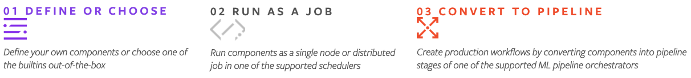

:github_url: https://github.com/pytorch/torchx

TorchX
==================

TorchX is an SDK for PyTorch related ML applications. It defines a standard struct
called :py:class:`torchx.specs.AppDef` that represents the job definition of an application.
The AppDef is the common language between :py:mod:`torchx.runner` and :py:mod:`torchx.pipelines` adapters.

**JUST GETTING STARTED?** First learn the :ref:`basic concepts<basics:Basics>` and
look at the :ref:`quickstart guide<quickstart:Quickstart>`.

In 1-2-3
-----------------

**01 DEFINE OR CHOOSE** Start by :ref:`writing a component<components/overview:Overview>` -- a python
function that returns an AppDef object for your application. Or you can choose one of the
:ref:`builtin components<Components>`.

**02 RUN AS A JOB** Once you've defined or chosen a component, you can :ref:`run it<runner:torchx.runner>`
by submitting it as a job in one of the supported :ref:`Schedulers<Schedulers>`. TorchX supports several
popular ones, such as Kubernetes and SLURM out of the box.

**03 CONVERT TO PIPELINE** In production, components are often run as a workflow (aka pipeline).
TorchX components can be converted to pipeline stages by passing them through the :py:mod:`torchx.pipelines`
adapter. :ref:`Pipelines<Pipelines>` lists the pipeline orchestrators supported out of the box.

Documentation
---------------

.. toctree::
   :maxdepth: 1
   :caption: Usage

   basics
   quickstart
   cli
   configure
   app_best_practices
   component_best_practices

.. toctree::
   :maxdepth: 1
   :caption: Examples

   examples_apps/index
   examples_pipelines/index

.. _torchx.api:
.. toctree::
   :maxdepth: 1
   :caption: API

   specs
   runner
   schedulers
   pipelines

Components Library
---------------------
.. _Components:
.. toctree::
   :maxdepth: 1
   :caption: Components

   components/overview
   components/train
   components/serve
   components/interpret
   components/metrics
   components/hpo
   components/base
   components/distributed
   components/utils

Runtime Library
----------------
.. toctree::
   :maxdepth: 1
   :caption: Runtime

   runtime/overview
   runtime/hpo
   runtime/tracking

Works With
---------------

.. _Schedulers:
.. toctree::
   :maxdepth: 1
   :caption: Schedulers

   schedulers/local
   schedulers/kubernetes
   schedulers/slurm

.. _Pipelines:
.. toctree::
   :maxdepth: 1
   :caption: Pipeline Adapters

   pipelines/kfp

Experimental
---------------
.. toctree::
   :maxdepth: 1
   :caption: Beta Features

   beta

